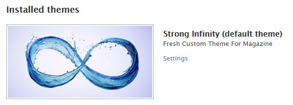
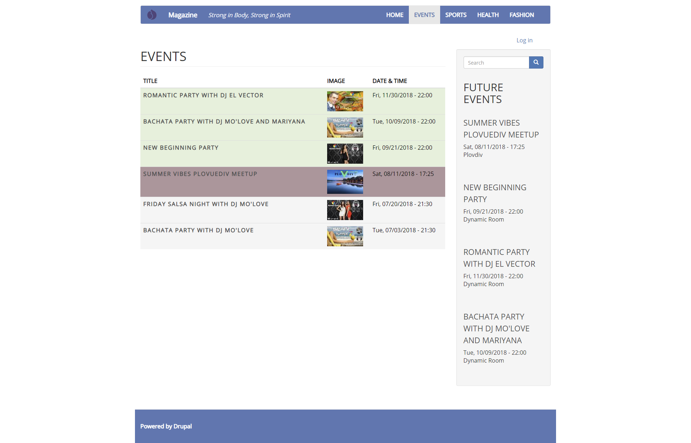

# Custom Magazine Site
## My Custom Theme - Strong Infinity for Drupal 8

A custom Website with articles and events, created with: Drupal 8, Acquia Dev Desktop 2, JavaScript, jQuery, CSS3. 

* Task Description:
    * [Task Part 1](/documents/site-building-task.pdf)
    * Task Part 2:
        * Create a custom theme.

        * Create different styles for the Events table:
            * green - for the future events;
            * red - for the closest event;
            * grey - for the previous events.

* My solution - Explanation:
    * [Part 1](/documents/Solution Part 1 - Magazine website - my first Drupal website.docx)
    * [Part 2](/documents/Solution Part 2 - Custom Site Strong Infinity.docx)
* [More Screenshots of My Site](screenshots/)
